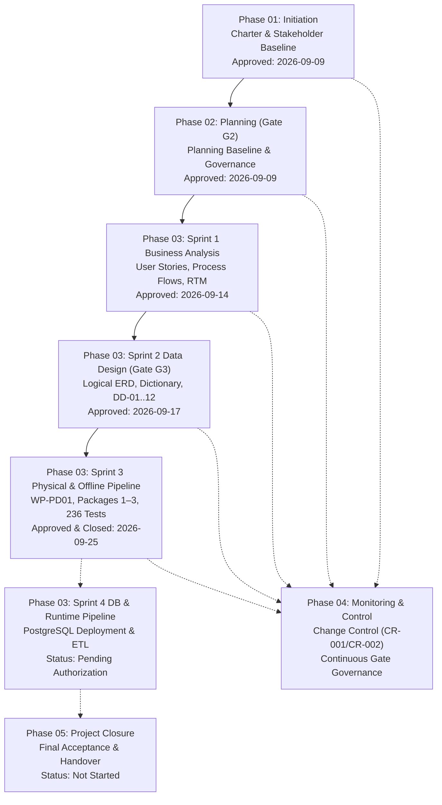

# Horizon Community Bank — Banking Operations & Customer Risk Analytics

> **Data & Business Analytics Lifecycle Portfolio Project**<br/>
> *A fictional, synthetic-data portfolio project demonstrating enterprise data analysis, business process modeling, data engineering, risk classification, and dimensional modeling.*

[](#verification--test-execution)
[](#source-reconciliation)
[](#documentation-roadmap)
[](#project-governance--safeguards)

---

## Current Status — 2026-09-25

**Sprint 3 offline implementation scope formally approved and closed on September 25, 2026** ([approval record](docs/04-monitoring-and-control/sprint-03-closure-approval.md)) based on the published [Sprint 3 Retrospective](docs/04-monitoring-and-control/sprint-03-retrospective.md) and overall closure review.

- **Offline Scope Completed:** Intake validation, curated processing pipeline, risk conditions RC-01..05, customer risk classification ($t/u$), core banking KPIs K01–K10, four dimensional analytical marts, and consolidated offline orchestration runner.
- **Verification Invariants:** 236 passed unit tests and 36 subtests across 34 test modules; 27 sections / 333 logical target field rows reconciled; 0 broken links across all Markdown documentation.
- **Fail-Closed Boundaries:** Physical production contracts PD-01 through PD-07 remain **Pending confirmation (Fail-Closed)**. Database execution / **PostgreSQL / PD02 remains UNAUTHORIZED**.

---

## Business Problem & Context

Horizon Community Bank is a fictional mid-sized regional bank operating across multiple branches. The institution faced critical operational and analytics bottlenecks:
- **Fragmented Data Silos:** Core Banking, Loan Servicing, Fraud Monitoring, and CRM data existed in separate operational systems without unified key reconciliation.
- **Delayed Reporting:** Month-end financial and operational reporting required three full business days of manual spreadsheet compilation and reconciliations.
- **Inconsistent Metrics:** Branches and executive teams used conflicting definitions for loan delinquency, customer risk, and operational SLAs.
- **Customer Risk Blindspots:** Fraud alerts, delinquent loans, and customer complaints were reviewed independently, leaving high-risk multi-product relationships undetected.

### Strategic Objectives
1. **Accelerate Reporting:** Reduce monthly executive and branch reporting from 3 business days to **under 4 hours**.
2. **Automated Daily Ingestion:** Deliver validated, reconciled daily metrics by **6:00 a.m. Central Time**.
3. **Single Source of Truth:** Establish one trusted dictionary and data model for Core Banking KPIs (K01–K10) with exact row and financial reconciliation.
4. **Holistic Risk Visibility:** Classify customer risk objectively across transactions, credit, fraud, and complaints using explainable conditions (RC-01 through RC-05) without opaque scoring models.

---

## High-Level Architecture

The solution implements an end-to-end data processing and analytics pipeline designed with strict governance and fail-closed safety boundaries:

```mermaid
flowchart LR
    subgraph Sources ["Simulated Sources (27 Sections)"]
        SRC01["Core Banking (SRC-01)<br/>Customers, Accounts, Transactions"]
        SRC02["Loan Servicing (SRC-02)<br/>Loans, Positions, Payments, Schedules"]
        SRC03["Fraud Monitoring (SRC-03)<br/>Alerts, Alert States"]
        SRC04["CRM Complaints (SRC-04)<br/>Complaints, Snapshots, History"]
        SRC05["Branch Reference (SRC-05)<br/>Units, Regions, Branches"]
    end

    subgraph Pipeline ["Curated Offline Pipeline"]
        IV["Intake & Manifest Validator<br/>Byte-level SHA-256 Check"]
        TR["Transformation & Masking<br/>DD-08 Last-4 Masking"]
        DQ["Data Quality & Quarantine<br/>DQ-D01..DQ-D13 Rules"]
        RC["Dual Reconciliation<br/>Exact Row (RC-D01) & Financial (RC-D02)"]
    end

    subgraph AnalyticsMart ["Analytics Engine & Marts"]
        RC_ENG["Risk Classification<br/>RC-01..05 & Exact t/u Rules"]
        KPI_ENG["Core Banking KPIs<br/>K01–K10 Computation"]
        MARTS["4 Dimensional Marts<br/>Transaction, Delinquency, Risk, Complaints"]
    end

    subgraph Packaging ["Artifact Packaging"]
        OUT["Curated Outputs<br/>accepted/, risk/, marts/"]
        SHA["Companion Checksums<br/>manifest.json.sha256"]
    end

    Sources --> IV --> TR --> DQ --> RC --> RC_ENG --> KPI_ENG --> MARTS --> OUT
    OUT --> SHA
```



### Dual Execution Modes
To guarantee safety and prevent accidental execution against unconfigured databases or incomplete vendor feeds, the pipeline operates under strict execution mode isolation:
- **`ExecutionMode.FIXTURE` (Authorized & Active):** Executes against verified, deterministic synthetic fixtures using standard-library implementations and isolated test registries. Generates verified JSON analytical marts and manifests.
- **`ExecutionMode.PRODUCTION` (Fail-Closed):** Binds strictly to `MasterProductionRegistry`. Because physical contracts PD-01 through PD-07 remain pending confirmation, production runs raise `PendingContractError` and fail closed immediately with zero output artifacts.

---

## Technology Stack

| Domain | Technology / Standard | Usage & Rationale |
| :--- | :--- | :--- |
| **Language** | Python 3.10+ / 3.12+ | Core intake, curated pipeline, risk classification, and KPI engines. Implemented using standard library modules for maximum portability and zero-dependency reproducibility. |
| **Testing** | `pytest` 9.1+ | 236 unit tests and 36 subtests covering intake, data quality, temporal boundaries, financial reconciliation, and pipeline orchestration. |
| **Database Architecture** | PostgreSQL 18 (Design Target) | Authoritative schema definition in `sql/migrations/0001_foundation.sql`. Static DDL review completed; database execution remains unauthorized pending PD02. |
| **Precision Arithmetic** | Python `Decimal` | Exact scale-4 arithmetic for all monetary amounts and reconciliation; scale-8 precision for ratio KPIs (K02, K03, K04, K05, K10). |
| **Temporal Logic** | `zoneinfo` (`America/Chicago`) | Standard Central Time business clock enforcement adhering to strict DST transition boundaries (PD-07). |
| **Data Modeling** | Relational & Star Schema | 109 logical entities normalized across 5 domains; 4 conformed dimensional marts ready for Power BI consumption. |
| **Governance** | Git / Markdown Baselines | Version-controlled requirements traceability matrix (RTM), data dictionary, decision logs, and gate control records. |

---

## Simulated Data Sources (27 Mandatory Sections)

The pipeline integrates extracts across five simulated source systems:

1. **SRC-01 Core Banking:** `customers`, `accounts`, `holders`, `transactions`, `account_restriction_state`, `account_branch_assignment`.
2. **SRC-02 Loan Servicing:** `loans`, `borrowers`, `positions`, `payments`, `loan_schedule`, `loan_obligation`, `payment_allocation`, `payment_unapplied`, `payment_adjustment`, `loan_account`, `loan_branch_assignment`.
3. **SRC-03 Fraud Monitoring:** `alerts`, `fraud_alert_state`.
4. **SRC-04 CRM Complaints:** `complaints`, `complaint_snapshot`, `complaint_history_event`, `complaint_branch_assignment`.
5. **SRC-05 Branch Reference:** `organizational_unit`, `region`, `branches`, `organizational_successor`.

---

## Chronological Project Lifecycle



| Phase / Sprint | Focus | Key Deliverables | Status | Approval Link |
| :--- | :--- | :--- | :--- | :--- |
| **Phase 01: Initiation** | Mandate & Governance | [Project Charter](docs/01-initiation/project-charter.md), [Stakeholder Register](docs/01-initiation/stakeholder-register.md) | Approved | [Charter](docs/01-initiation/project-charter.md) |
| **Phase 02: Planning** | Baseline & Quality Gate G2 | [Master Planning Baseline](docs/02-planning/Horizon_Community_Bank_Project_Planning_Baseline.md) | Approved (2026-09-09) | [Planning README](docs/02-planning/README.md) |
| **Phase 03: Sprint 1** | Business Analysis | [Product Backlog](docs/03-execution/sprint-01-business-analysis/product-backlog.md), [Process Flows](docs/03-execution/sprint-01-business-analysis/process-flows.md), [RTM](docs/03-execution/sprint-01-business-analysis/requirements-traceability-matrix.md) | Approved (2026-09-14) | [Sprint 1 Approval](docs/04-monitoring-and-control/sprint-01-approval-record.md) |
| **Phase 03: Sprint 2** | Logical Data Design (Gate G3) | [Logical ERD](docs/03-execution/sprint-02-data-design/logical-data-model.md), [Field Dictionary](docs/03-execution/sprint-02-data-design/field-level-dictionary.md), [Customer Risk Catalog](docs/03-execution/sprint-02-data-design/customer-risk-catalog.md), DD-01..DD-12 | Approved (2026-09-17) | [G3 Decision](docs/04-monitoring-and-control/g3-data-design-approval.md) |
| **Phase 03: Sprint 3** | Physical Design & Offline Intake | [WP-PD01 DDL](sql/migrations/0001_foundation.sql), PD-01..07 Rules, Offline Intake Engine, Packages 1–3, 236 Tests | Approved & Closed (2026-09-25) | [Sprint 3 Closure](docs/04-monitoring-and-control/sprint-03-closure-approval.md) |
| **Phase 04: Control** | Monitoring & Change Control | [CR-001](docs/04-monitoring-and-control/change-control/CR-001-kpi-and-risk-refinements.md), [CR-002](docs/04-monitoring-and-control/change-control/CR-002-baseline-lifecycle-corrections.md), [CR-002 Decisions](docs/04-monitoring-and-control/change-control/CR-002-project-owner-decisions-2026-09-21.md), [Sprint 3 Retrospective](docs/04-monitoring-and-control/sprint-03-retrospective.md) | Maintained Continuously | [Control README](docs/04-monitoring-and-control/README.md) |
| **Phase 05: Closure** | Acceptance & Handover | Reserved for final operational transition and post-implementation review | Not Started | [Closure README](docs/05-closure/README.md) |

---

## Core Analytical Features & Banking Rules

1. **Non-Additive Relationship Exposure (DD-02):** Shared loan balances and deposits across joint accounts/co-borrowers are labeled *Relationship Exposure*. They are strictly non-additive across customers; institution-wide totals are computed solely from distinct account-grain facts.
2. **Customer Risk Classification (RC-01..05 & Exact $t/u$ Logic):**
   - Evaluates five distinct conditions: RC-01 (Large transactions), RC-02 (Critical fraud alerts), RC-03 (Delinquent loans $>30$ DPD), RC-04 (Critical complaints), and RC-05 (Restricted account status).
   - High-risk threshold $t \ge 2$; unknown-condition count $u$. Segregates `INCOMPLETE_EVIDENCE` and `UNAVAILABLE` as distinct unknown populations, never conflating them with confirmed low-risk customers.
3. **Core Banking KPIs (K01–K10):**
   - K01: Transaction Volume (terminal status filtered, half-open intervals).
   - K02 & K03: Transaction Success and Failure Rates (4-status eligible denominator).
   - K04: Fraud Alert Rate (eligible 4-status cohort).
   - K05: Delinquent Loan Rate (strict $\text{DPD} > 30$ boundary).
   - K06: Delinquent Principal Balance (currency-separated, DD-09 publication gated).
   - K07: High-Risk Customer Concentration ($t \ge 2$, non-additive exposure).
   - K08: Average Complaint Resolution Time (24/7 continuous calendar clock).
   - K09: Open Complaints Count.
   - K10: Complaint SLA Breach Rate (strict $>$ threshold, no clock resets on reopen).
4. **Four Conformed Dimensional Marts:**
   - `mart_transaction_kpis` (grain: `business_date + channel_id + transaction_type`)
   - `mart_loan_delinquency_kpis` (grain: `business_date + branch_id + loan_type`)
   - `mart_customer_risk_kpis` (grain: `business_date + branch_id + customer_segment`)
   - `mart_complaint_kpis` (grain: `business_date + product_category + branch_id`)
5. **Dual Reconciliation Architecture:**
   - Row Count Reconciliation (`RC-D01`): $\text{received} = \text{accepted} + \text{quarantined} + \text{approved\_excluded}$
   - Financial Reconciliation (`RC-D02`): $\text{source\_total} = \text{accepted} + \text{quarantined} + \text{approved\_excluded}$ with zero unexplained variance.

---

## Setup & Quickstart

### Prerequisites
- Python 3.10+ (Python 3.12+ recommended)
- Git

### Environment Configuration
1. Clone the repository:
   ```bash
   git clone https://github.com/yaswanthsivala-wq/horizon-bank-analytics.git
   cd horizon-bank-analytics
   ```
2. Create and activate a virtual environment:
   ```bash
   # Windows PowerShell
   python -m venv .venv
   .\.venv\Scripts\Activate.ps1

   # Linux / macOS
   python3 -m venv .venv
   source .venv/bin/activate
   ```
3. Set the Python module search path:
   ```bash
   # Windows PowerShell
   $env:PYTHONPATH = "src"

   # Linux / macOS
   export PYTHONPATH=src
   ```

---

## Verification & Test Execution

### 1. Run Complete Automated Test Suite
Execute the full regression suite across all 34 test modules:
```bash
pytest -v
```
*Expected Result:* 236 passed, 36 subtests passed with 0 failures, 0 errors, and 0 warnings.

### 2. Verify Source Field Reconciliation Invariant
Run the authoritative source-field reconciliation script to verify the alignment between the logical dictionary and physical intake:
```bash
python scripts/reconcile_source_fields.py
```
*Expected Result:* `27 sections, 333 logical target field rows` (0 diffs against `source-field-inventory.md`).

### 3. Programmatic Pipeline Execution (Offline Fixture Mode)
The consolidated offline runner can be invoked programmatically to process synthetic banking batches:
```python
from datetime import date
from pathlib import Path
from horizon_pipeline.orchestration.runner import ConsolidatedPipelineRunner
from horizon_pipeline.processing.records import ExecutionMode
from horizon_pipeline.synthetic import (
    SyntheticBankingDataGenerator,
    build_serialized_fixture_package,
)

# 1. Generate deterministic synthetic dataset
gen = SyntheticBankingDataGenerator(seed=42, business_date=date(2025, 3, 9))
dataset = gen.generate(num_customers=10, num_transactions=25, num_loans=5)
pkg = build_serialized_fixture_package(dataset, revision=1)

# 2. Execute consolidated pipeline
runner = ConsolidatedPipelineRunner()
result = runner.run_package(
    manifest_json=pkg.manifest_json,
    payloads=pkg.payloads,
    execution_mode=ExecutionMode.FIXTURE,
    output_dir=Path("./output_artifacts"),
)

print(f"Pipeline Result: {result.disposition.value} (Passed: {result.passed})")
print(f"Generated Risk Assessments: {len(result.risk_assessments)}")
print(f"Analytical Marts Generated: {result.marts_result is not None}")
```

---

## Project Governance & Safeguards

- **Synthetic Data Only:** The repository contains zero real bank or customer data. All customer names, account numbers, and transactions are deterministically generated.
- **Fail-Closed Production Boundaries:** Master production registries remain pending confirmation. Missing physical headers or unconfirmed mappings immediately fail closed.
- **PostgreSQL / PD02 Unauthorized:** Local or remote database inspection, execution, migration, or connection is strictly unauthorized until formal gate approval.
- **Preservation of Untracked Baselines:** Test transcripts such as `package2-test-results.txt` remain intentionally untracked and preserved.
- **Read-Only Codebase Discipline:** All repository modifications require strict traceability, pre-execution verification, and explicit gate approvals.

---

## Documentation Roadmap

```
horizon-bank-analytics/
├── README.md                                  # Root portfolio overview & setup (Current document)
├── PROJECT_STATUS.md                          # Master project status and milestone register
├── CHANGELOG.md                               # Chronological repository change history
├── AGENTS.md                                  # Project working instructions & governance rules
├── docs/
│   ├── 01-initiation/                         # Phase 01: Project charter & stakeholder register
│   ├── 02-planning/                           # Phase 02: Planning baseline & governance policies
│   ├── 03-execution/                          # Phase 03: Sprints 1, 2, and 3 deliverables
│   │   ├── sprint-01-business-analysis/       # User stories, process flows, RTM
│   │   ├── sprint-02-data-design/             # Logical data models, dictionaries, DD-01..12
│   │   └── sprint-03-physical-design/         # Physical architecture, annexes, offline packages
│   ├── 04-monitoring-and-control/             # Phase 04: Change control, approvals, retrospectives
│   └── 05-closure/                            # Phase 05: Reserved for acceptance & handover
├── sql/
│   └── migrations/0001_foundation.sql         # Target PostgreSQL 18 static DDL schema
├── src/horizon_pipeline/                      # Core pipeline implementation (standard library)
│   ├── contracts/                             # Contract state models, headers, temporal, financial
│   ├── processing/                            # Intake, transforms, masking, quality, reconciliation
│   ├── analytics/                             # Risk conditions, customer classification, KPIs, marts
│   ├── orchestration/                         # Consolidated offline pipeline runner
│   └── synthetic/                             # Deterministic synthetic data generator & fixtures
├── scripts/
│   └── reconcile_source_fields.py             # Authoritative source-field reconciliation script
└── tests/                                     # 34 automated unit and integration test modules
```
