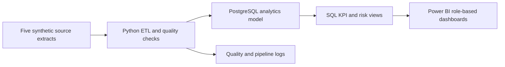

# Horizon Community Bank
## Banking Operations & Customer Risk Analytics

**Document:** Project Planning Baseline  
**Version:** 1.0  
**Date:** September 9, 2026  
**Project role:** Data Analyst / Business Analyst  
**Delivery method:** Agile, six one-week sprints  
**Data classification:** Synthetic portfolio data only

---

## 1. Approval Record

The Initiation phase was approved by the project sponsor on September 9, 2026. This document converts the approved initiation into the Planning baseline. Execution must not introduce unsupported claims, real customer information, or unapproved scope.

## 2. Executive Summary

Horizon Community Bank currently relies on separate operational reports from Core Banking, Loan Operations, Fraud Operations, Customer Service, and Branch Administration. Manual consolidation produces delayed reporting, inconsistent KPI calculations, customer-identity reconciliation problems, and no unified view of operational and customer risk.

The project will deliver a daily analytics platform using synthetic banking data. It will integrate five simulated source systems, validate and transform their data, calculate approved KPIs, identify customers meeting provisional risk conditions, and provide role-appropriate Power BI reporting. Release 1 will use daily batch processing rather than real-time integration.

## 3. Business Objectives

1. Reduce monthly management-report preparation from three business days to less than four hours.
2. Deliver validated daily reporting data by 6:00 a.m. Central Time.
3. Establish documented, consistent definitions for all Release 1 KPIs.
4. Create a unified view of customer, account, loan, fraud, complaint, and branch activity.
5. Enable authorized users to investigate operational problems using controlled drill-down paths.
6. Protect sensitive fields through role-based visibility, masking, and export controls.

## 4. Scope Baseline

### 4.1 In Scope

- Synthetic source data representing Core Banking, Loan Servicing, Fraud Monitoring, CRM, and Branch Reference systems.
- Twenty-four months of history.
- Daily batch ingestion from all five sources.
- PostgreSQL analytical database.
- Python extraction, validation, transformation, and loading pipeline.
- Reconciliation and data-quality exception reporting.
- Customer identity standardization across source systems.
- Approved KPI calculations and prior-period comparisons.
- Configurable provisional customer-risk rules.
- Power BI pages for executives, operations, fraud, lending, complaints, and data quality.
- Filters for date, region, branch, account type, transaction type/status, loan type, risk level, complaint priority, and fraud-alert status.
- Region and branch drill-down for managers.
- Customer, masked-account, transaction, and case drill-down for authorized analysts.
- CSV/PDF exports restricted according to role.
- Documentation, testing evidence, management recommendations, and GitHub portfolio material.

### 4.2 Out of Scope

- Production banking connections or real customer data.
- Streaming or real-time processing.
- Hourly fraud-system integration.
- Predictive machine-learning fraud decisions.
- Automatic account blocking, loan decisions, or fraud determinations.
- A permanently approved enterprise risk definition.
- Commitments to reduce fraud losses or delinquency by a specified percentage.
- Mobile application development.

## 5. Assumptions and Constraints

### Assumptions

- All project data is synthetic and contains no personally identifiable real-world customer information.
- Each source supplies one daily extract.
- Source owners approve field definitions and sample reconciliation results.
- Power BI Desktop is available for local dashboard development.
- PostgreSQL, Python, Git, and GitHub are available on the development laptop.

### Constraints

- One-person portfolio delivery team.
- Six-week target schedule.
- No paid enterprise infrastructure is required.
- Security behavior will be demonstrated through data design and Power BI role simulation rather than a production identity provider.
- The daily 6:00 a.m. target will be validated using simulated scheduled runs.

## 6. Stakeholders and Responsibilities

| Stakeholder | Responsibility | Approval authority |
|---|---|---|
| Project Sponsor | Funding, priority, scope decisions | Charter, scope, final release |
| Director of Banking Operations | Operational requirements and core-banking definitions | Operations KPIs |
| Loan Operations Manager | Loan and delinquency definitions | Loan KPIs |
| Fraud Manager | Fraud-alert definitions and investigation needs | Fraud indicators |
| Customer Service Manager | Complaint definitions and SLA rules | Complaint KPIs |
| Risk Manager | Provisional customer-risk rules | Risk logic |
| Compliance Officer | Masking, access, retention, and exports | Compliance release approval |
| Branch Administration Manager | Branch hierarchy and ownership | Branch reference data |
| Data Analyst / Business Analyst | Requirements, analysis, testing, dashboards, documentation | Delivery recommendation |

## 7. Requirements Baseline

### 7.1 Functional Requirements

| ID | Requirement | Priority |
|---|---|---|
| FR-01 | Load daily extracts from five simulated source systems. | Must |
| FR-02 | Store and analyze 24 months of historical data. | Must |
| FR-03 | Standardize customer and account identifiers across sources. | Must |
| FR-04 | Detect duplicates, missing required fields, invalid dates, orphan records, and invalid status values. | Must |
| FR-05 | Calculate all approved Release 1 KPIs using documented formulas. | Must |
| FR-06 | Compare selected-period KPIs with the preceding comparable period. | Must |
| FR-07 | Flag customers meeting at least two configured risk conditions. | Must |
| FR-08 | Flag transaction amounts at least three times the customer's preceding 90-day average as an unusual-activity indicator. | Must |
| FR-09 | Provide executive, operations, fraud, lending, complaints, and quality dashboard views. | Must |
| FR-10 | Apply the approved filters and role-appropriate drill-down paths. | Must |
| FR-11 | Mask account numbers to the final four digits in reporting outputs. | Must |
| FR-12 | Restrict customer-level reporting and exports by role. | Must |
| FR-13 | Produce pipeline-run, reconciliation, and data-quality summaries. | Must |
| FR-14 | Support authorized CSV and PDF exports. | Should |

### 7.2 Nonfunctional Requirements

| ID | Requirement | Acceptance target |
|---|---|---|
| NFR-01 | Availability | Daily dataset ready by 6:00 a.m. CT in at least 95% of test runs |
| NFR-02 | Completeness | At least 98% completeness across required reporting fields |
| NFR-03 | Accuracy | KPI samples reconcile to approved SQL calculations with zero unexplained variance |
| NFR-04 | Dashboard performance | Summary pages within 5 seconds; drill-down pages within 10 seconds |
| NFR-05 | Export performance | Approved export completes within 30 seconds |
| NFR-06 | Capacity | Design assumption of 100 concurrent dashboard users |
| NFR-07 | Auditability | Pipeline results, exceptions, and simulated export events are traceable |
| NFR-08 | Retention | Analytics: 24 months; pipeline/quality and export audit logs: 7 years (documented design) |
| NFR-09 | Maintainability | Risk thresholds and mappings are configuration-driven where practical |

## 8. KPI Dictionary

| KPI | Formula / rule |
|---|---|
| Transaction Volume | Count of processed transactions in the selected period |
| Transaction Success Rate | Successful transactions / eligible processed transactions × 100 |
| Transaction Failure Rate | Failed transactions / eligible processed transactions × 100 |
| Fraud-Alert Rate | Distinct transactions with at least one fraud alert / total transactions × 100 |
| Loan Delinquency Rate | Active loans over 30 days past due / total active loans × 100 |
| Outstanding Delinquent Balance | Sum of outstanding principal on loans over 30 days past due |
| High-Risk Customers | Distinct customers meeting at least two configured provisional risk conditions |
| Average Complaint Resolution Time | Average hours from complaint creation to closure |
| Open Complaints | Complaints without a closed date and not in Closed status |
| SLA Breach Rate | Eligible complaints exceeding their priority SLA / total eligible complaints × 100 |

Cancelled and reversed transactions are reported separately and excluded from transaction success/failure denominators.

### Complaint SLA Configuration

| Priority | SLA |
|---|---:|
| Critical | 4 hours |
| High | 24 hours |
| Medium | 72 hours |
| Low | 120 hours |

## 9. Solution Architecture

### Planned Data Layers

1. **Raw:** Source-shaped extracts retained without analytical changes.
2. **Staging:** Standardized data types, identifiers, timestamps, and statuses.
3. **Curated:** Conformed customers/accounts and validated business entities.
4. **Analytics:** KPI views, risk flags, trend tables, and dashboard-ready measures.
5. **Audit:** Pipeline runs, rejected records, reconciliation totals, and simulated exports.

## 10. Planned Data Entities

| Entity | Purpose | Approximate rows |
|---|---|---:|
| Branches | Branch and regional hierarchy | 50 |
| Customers | Customer profile and segment | 10,000 |
| Accounts | Deposit/transaction accounts | 15,000 |
| Transactions | Financial activity and status | 250,000 |
| Loans | Loan products and balances | 6,000 |
| Loan Payments | Scheduled and actual payments | 50,000 |
| Fraud Alerts | Alert reason, severity, and case status | 8,000 |
| Complaints | Priority, SLA, channel, and resolution | 5,000 |
| Risk Assessments | Condition flags and risk classification | Derived |

## 11. Work Breakdown Structure

1. **Project Governance**
   - Maintain charter, decisions, risks, issues, changes, and weekly status.
2. **Business Analysis**
   - Finalize requirements, KPI dictionary, user stories, process flows, traceability matrix, and UAT plan.
3. **Data Design**
   - Define source schemas, data dictionary, ERD, mappings, quality rules, and analytical model.
4. **Data Generation**
   - Generate synthetic records, controlled anomalies, cross-source identifier differences, and historical distributions.
5. **Engineering**
   - Build PostgreSQL schema, Python pipeline, configurations, logging, validation, reconciliation, and rerun controls.
6. **Analytics**
   - Build SQL KPI views, segmentation, trends, drill-down datasets, and risk logic.
7. **Visualization**
   - Create Power BI semantic model, measures, dashboard pages, filters, drill-through, masking demonstration, and exports.
8. **Testing**
   - Execute unit, integration, reconciliation, data-quality, security, performance, and UAT tests.
9. **Release and Closure**
   - Publish documentation, screenshots, management recommendations, lessons learned, and portfolio presentation.

## 12. Sprint Schedule

| Sprint | Primary outcomes | Exit evidence |
|---|---|---|
| Week 1 — Requirements | Charter, requirements, user stories, process flows, traceability skeleton | Requirements review completed |
| Week 2 — Data Design | ERD, data dictionary, mappings, quality rules, synthetic-data specification | Design review completed |
| Week 3 — Data Pipeline | Generated datasets, PostgreSQL schema, ETL, logs, reconciliation | Repeatable successful load |
| Week 4 — Analysis | SQL KPI views, risk conditions, EDA, validated calculations | KPI reconciliation passed |
| Week 5 — Dashboard | Power BI model, measures, six report views, filtering and drill-through | Internal test passed |
| Week 6 — UAT & Closure | Defect fixes, UAT evidence, recommendations, README, screenshots, presentation | Sponsor release decision |

## 13. Prioritized Product Backlog

| Rank | Story | Priority | Planned sprint |
|---:|---|---|---:|
| 1 | As an executive, I need summarized KPIs so I can assess bank performance without accessing customer details. | Must | 5 |
| 2 | As an operations manager, I need region-to-branch analysis so I can locate operational problems. | Must | 4–5 |
| 3 | As a fraud analyst, I need unusual-activity indicators and alert history so I can prioritize investigation. | Must | 4–5 |
| 4 | As a loan manager, I need delinquent accounts and balances by aging band so I can prioritize follow-up. | Must | 4–5 |
| 5 | As a service manager, I need complaint and SLA analysis so I can address overdue cases. | Must | 4–5 |
| 6 | As a risk analyst, I need explainable customer-risk conditions so I can understand why a customer was flagged. | Must | 4–5 |
| 7 | As a compliance officer, I need restricted and masked reporting so sensitive information is protected. | Must | 5–6 |
| 8 | As a data owner, I need daily quality and reconciliation results so I can trust published KPIs. | Must | 3–6 |

Detailed Given–When–Then acceptance criteria will be completed during Week 1 and linked to the Requirements Traceability Matrix.

## 14. Testing and Quality Plan

| Test category | Examples | Required evidence |
|---|---|---|
| Unit | Risk-condition functions, masking, KPI calculations | Automated test results |
| Data Quality | Nulls, duplicates, invalid codes, referential integrity, dates | Exception summary |
| Integration | Raw-to-staging-to-curated row movement | Pipeline-run log |
| Reconciliation | Counts and amounts between source and target | Reconciliation report |
| Security | Role visibility, masking, export restrictions | Role test matrix |
| Performance | Refresh duration and report response | Timed test results |
| UAT | Business scenarios and expected results | Signed test cases |

### Definition of Done

A deliverable is done only when:

- Its linked requirement and acceptance criteria are satisfied.
- Code executes without unresolved critical errors.
- Relevant tests pass and evidence is saved.
- No sensitive or secret values are committed.
- Documentation reflects the implemented behavior.
- Any deviation from baseline is recorded and approved.

## 15. Risk Register

| ID | Risk | Probability | Impact | Response |
|---|---|---|---|---|
| R-01 | Synthetic data appears unrealistic | Medium | High | Use documented distributions, dependencies, and controlled anomalies |
| R-02 | Customer linkage across sources fails | High | High | Define canonical IDs, crosswalk table, and exception queue |
| R-03 | KPI definitions change during development | Medium | High | Central KPI dictionary and change control |
| R-04 | Risk flag is mistaken for proven fraud | Medium | High | Use explainable indicator wording and explicit disclaimer |
| R-05 | Dashboard becomes too large or slow | Medium | Medium | Star schema, aggregated views, limited visuals, performance testing |
| R-06 | Project scope exceeds six weeks | High | Medium | Protect Must items; defer Should/Could items |
| R-07 | Credentials are exposed in Git | Low | High | `.env`, `.gitignore`, secret scan, and commit review |
| R-08 | ETL reruns create duplicate records | Medium | High | Idempotent loads, keys, upserts, and rerun tests |
| R-09 | Portfolio claims imply production banking use | Medium | High | Clearly label fictional organization and synthetic dataset |

## 16. Communication and Governance

| Activity | Frequency | Output |
|---|---|---|
| Sprint planning | Weekly | Sprint goal and selected backlog |
| Status review | Weekly | Completed, planned, risks, issues, decisions |
| Requirement clarification | As needed | Updated decision/open-question log |
| Change review | Before baseline change | Approved/rejected change record |
| Sprint demonstration | End of each sprint | Evidence and stakeholder feedback |
| Closure review | End of Week 6 | Acceptance, lessons learned, handoff |

## 17. Change-Control Process

1. Record the requested change and business reason.
2. Assess scope, schedule, data, security, and quality impact.
3. Recommend approve, reject, or defer.
4. Obtain sponsor approval for baseline changes; obtain Risk/Compliance approval when applicable.
5. Update requirements, backlog, traceability, tests, and documentation.
6. Implement only after approval.

## 18. Monitoring and Control Measures

- Sprint completion percentage.
- Planned versus completed deliverables.
- Open requirements and decisions.
- Open defects by severity.
- Data completeness and reconciliation variance.
- ETL execution duration and readiness time.
- Test pass rate.
- Requirement coverage in the traceability matrix.
- Scope changes and schedule impact.
- Top active risks and mitigation status.

Project status will be classified as:

- **Green:** No material threat to scope, schedule, or quality.
- **Amber:** Corrective action is required, but the baseline remains achievable.
- **Red:** Baseline cannot be achieved without sponsor action or approved change.

## 19. Approval Gates

| Gate | Required before | Approval evidence |
|---|---|---|
| G1 Initiation | Planning | Approved September 9, 2026 |
| G2 Planning Baseline | Execution | Sponsor approval of this plan |
| G3 Data Design | ETL construction | Approved ERD, dictionary, and mappings |
| G4 Analytics Validation | Dashboard finalization | Reconciled KPI and risk calculations |
| G5 UAT and Compliance | Release | Passed UAT and security/masking review |
| G6 Closure | Project completion | Sponsor acceptance and lessons learned |

## 20. Execution Entry Criteria

Execution may begin after Gate G2 when:

- The scope and six-week schedule are accepted.
- The functional and nonfunctional requirements are accepted.
- The KPI definitions are accepted as the initial baseline.
- The synthetic-data-only limitation is acknowledged.
- The provisional high-risk rule is accepted as an analytical indicator, not an automated fraud decision.

## 21. Immediate Execution Queue After Approval

1. Create repository structure and environment files.
2. Create the detailed eight-story backlog with acceptance criteria.
3. Produce the AS-IS and TO-BE process flows.
4. Create the Requirements Traceability Matrix.
5. Design the source-to-target data model, ERD, and data dictionary.
6. Submit Gate G3 for approval before constructing the pipeline.

---

**Planning status:** Complete — awaiting Gate G2 approval.  
**Approval command:** `/approve planning`
