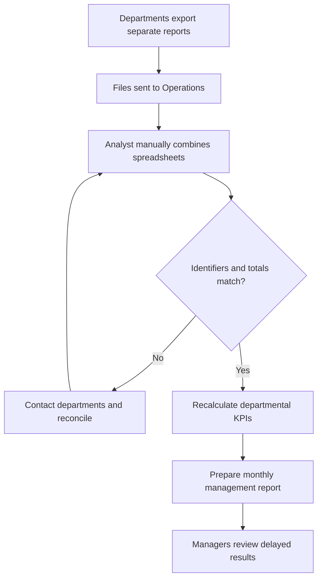
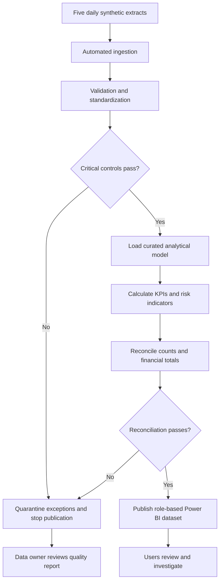
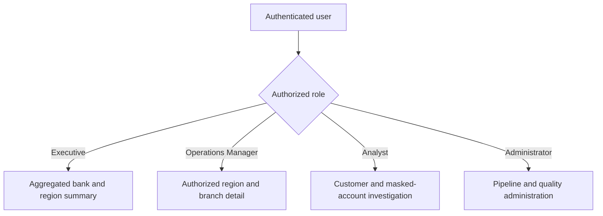
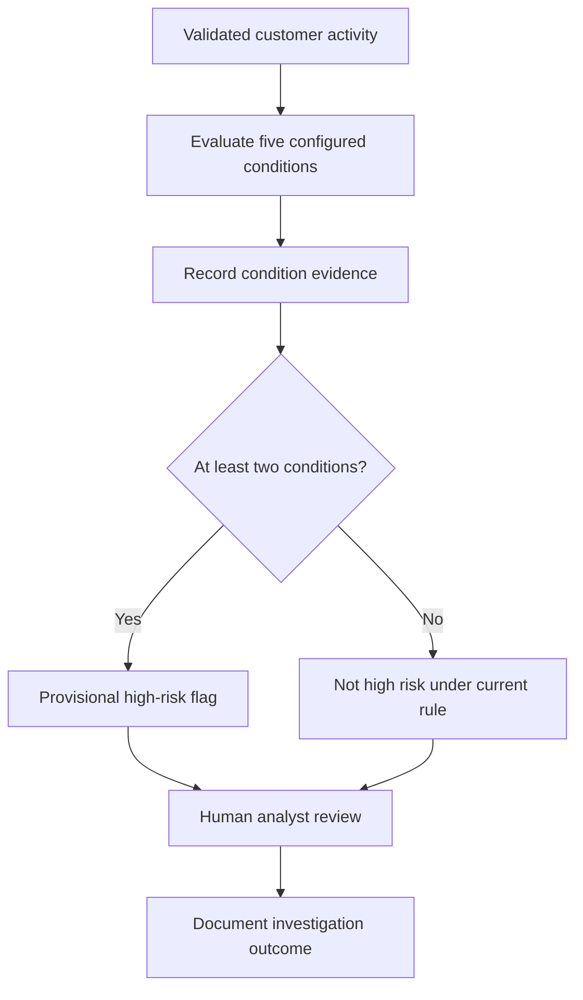

# Business Process Flows

## AS-IS: Current Manual Reporting Process

### Current-State Problems

- Separate reports arrive on different schedules.
- Customer and account identifiers are inconsistent.
- Manual spreadsheet consolidation is error-prone.
- KPI formulas differ across departments.
- Reconciliation delays monthly reporting by approximately three business days.
- Managers cannot easily drill from summary results to the responsible branch or account.
- There is no combined customer-risk view.

## TO-BE: Release 1 Daily Analytics Process

## Role-Based Navigation

## Risk-Assessment Flow

The unusual-transaction rule compares a transaction with the customer's preceding 90-day average. It is one risk indicator and never confirms fraud automatically.

## Process Improvement Expected

| Area | AS-IS | TO-BE |
|---|---|---|
| Frequency | Monthly consolidated report | Validated daily dataset |
| Preparation | Manual spreadsheet work | Automated, controlled pipeline |
| KPI definitions | Department-specific | Central approved dictionary |
| Data quality | Discovered during reporting | Validated before publication |
| Investigation | Separate reports | Controlled drill-down |
| Customer risk | Fragmented | Explainable combined indicators |
| Security | File-dependent | Role-specific views and masking |

