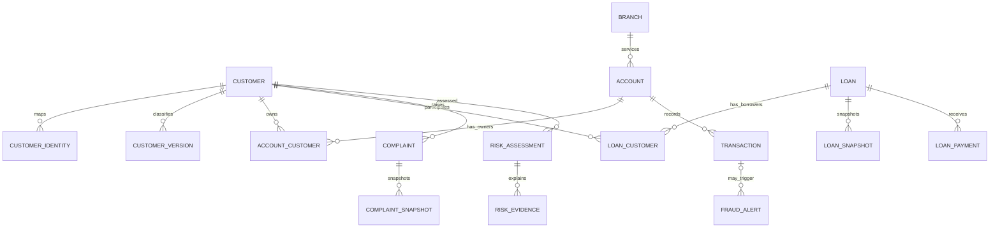
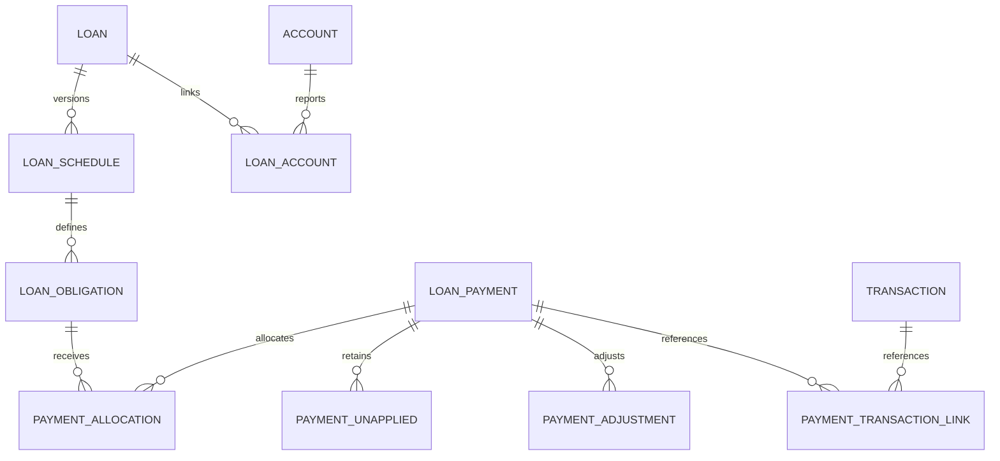
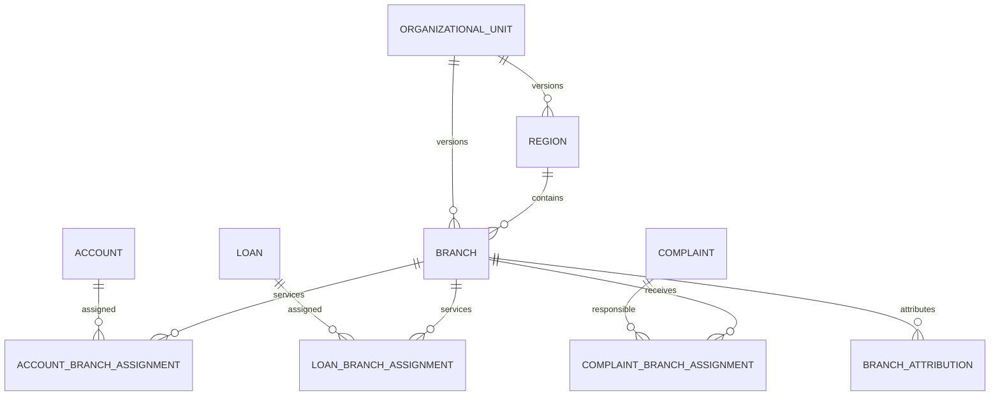
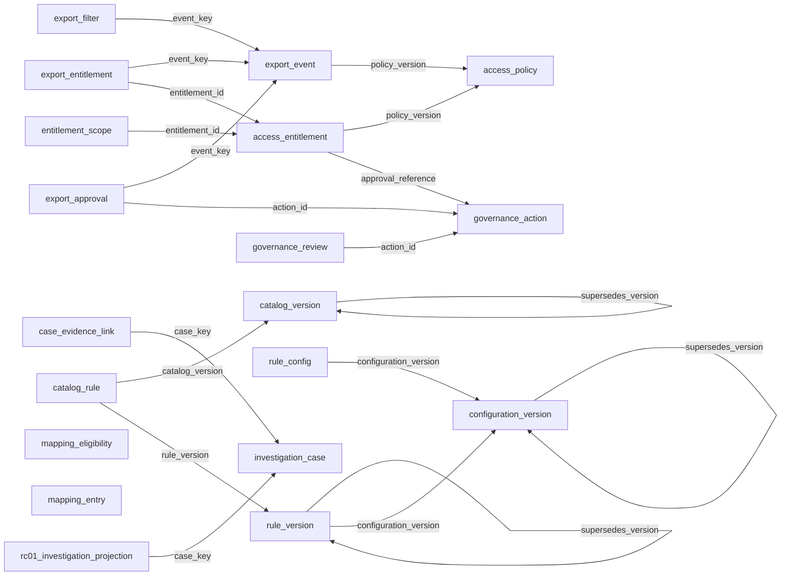
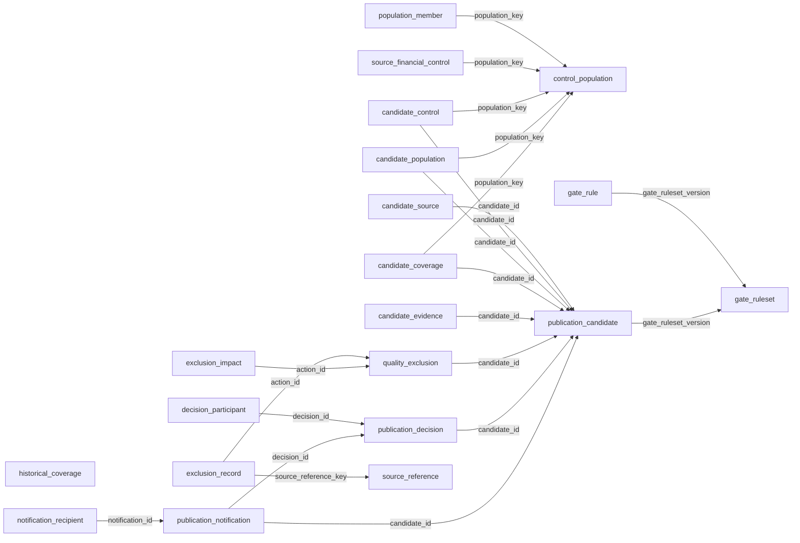
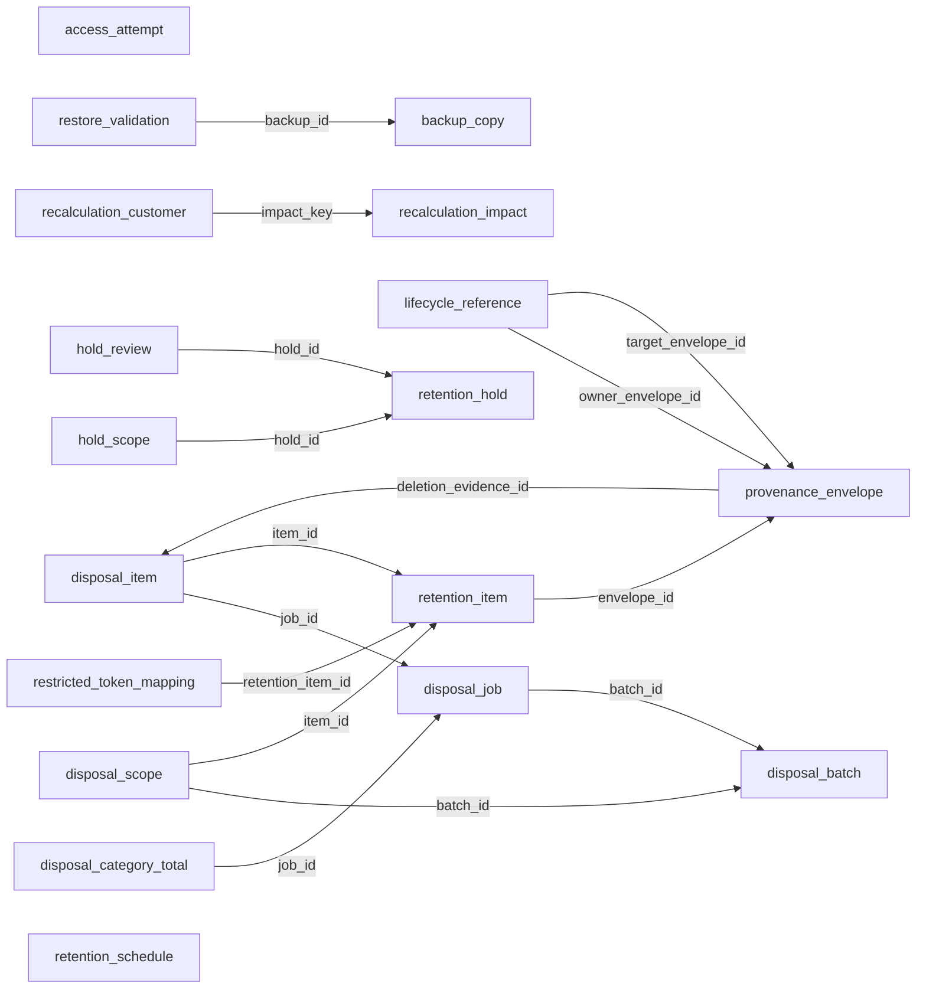
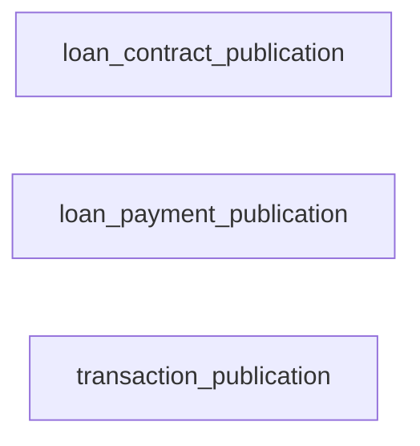
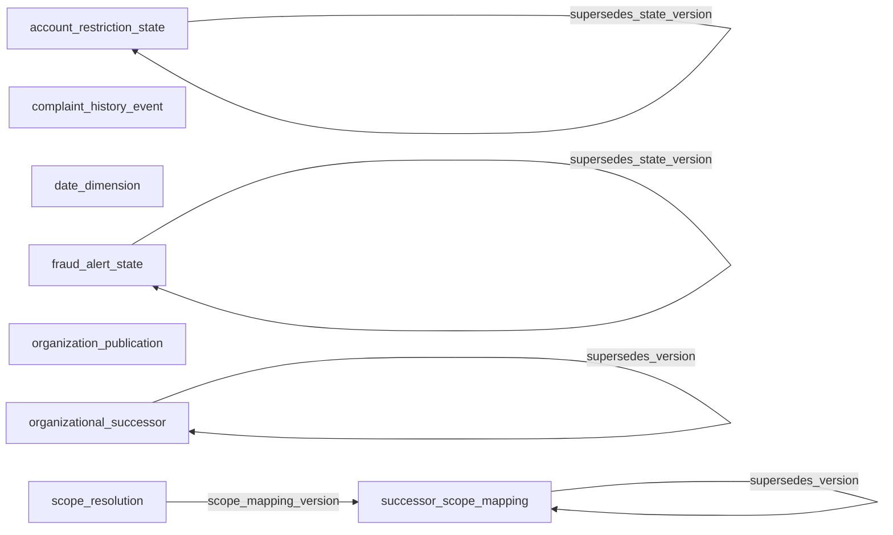

# Data model and ERD

Status: **Sprint 2 logical design — approved; Gate G3 approved 2026-09-17 (logical design only)** — see [G3 decision](../../04-monitoring-and-control/g3-data-design-approval.md). Proposed physical aliases and domains remain unconfirmed until authorized implementation. The earlier "Draft — not approved" label reflects the state before DD-01–DD-12 and G3 approval and is retained in dated history.

### Historical status (superseded)

Status: **Draft — not approved**

## Approved basis

Five synthetic source systems, daily extracts, twenty-four months of history, PostgreSQL, Python ETL, and Power BI are confirmed in the [Planning baseline](../../02-planning/Horizon_Community_Bank_Project_Planning_Baseline.md). The model below is a proposal supporting those requirements.

## Proposed grains and history

| Entity | Grain / key | History and purpose |
| --- | --- | --- |
| branch | One branch version; branch_key | Retain effective intervals for region and hierarchy changes; stable branch_id |
| customer | One canonical customer; customer_key | Restricted identity attributes; segment history held separately |
| customer_identity | One source-system/customer-ID mapping per effective interval | Maps source IDs to canonical customers; unique nonoverlapping mapping |
| customer_version | One segment/branch assignment interval per customer | Historical reporting must use event-date classification, not current values |
| account | One source-qualified account; account_key | Store opening/closure dates and branch; account number restricted |
| account_customer | One account/customer/role interval | All owners; effective-dated roles and non-additive relationship exposure approved in DD-02 |
| transaction | One source-qualified transaction | Event time, account, amount, currency, raw and canonical status |
| loan | One source-qualified loan | Origination attributes; all borrowers linked through loan_customer |
| loan_customer | One loan/customer/role interval | All borrowers and co-borrowers; DD-02 non-additive relationship exposure |
| loan_snapshot | One loan per business date | Outstanding principal, days past due and status for historical delinquency |
| loan_payment | One source-qualified payment event | Immutable actual event; positive amount, four statuses; only POSTED financial |
| fraud_alert | One source-qualified alert | Optional transaction reference; customer reference where available; unresolved references quarantined |
| complaint | One source-qualified complaint | Created/closed instants, priority, channel, status and customer |
| complaint_snapshot | One complaint per business date | Historical open/SLA position without using future closure information |
| risk_assessment | One customer, business date, rule/catalog version and publication | Provisional classification with evidence completeness state |
| risk_evidence | One assessment per condition | One condition outcome; observations/windows/source references in logical child entities |
| pipeline_run / source_extract | One attempt / source batch manifest | Immutable provenance and completion controls |
| quality_exception / reconciliation_result | One rule finding / control comparison | Planned audit evidence |
| export_event | One simulated authorized export | Role, report, instant, format, filter context; no raw sensitive values |

All event and snapshot keys include source identity or canonical identity as appropriate. Duplicate source IDs across systems must not collide.

## Proposed conceptual relationships

ERD scope: the diagrams below depict 41 of the 109 logical entities (core ownership, event, snapshot and risk entities). The remaining 68 governance, publication, quality, retention, payment-schedule and organizational-history entities are defined only in the [authoritative inventory](field-level-dictionary.md); see also the [relationship register](relationship-register.md).

DD-02 approves all owner and co-borrower relationships through effective-dated role bridges. A fraud alert need not have a transaction reference, but any supplied reference must resolve. Shared activity is attributed non-additively; it does not identify which owner initiated a transaction.

## Identity proposal

Use a deterministic synthetic master-ID crosswalk. Exact approved mappings resolve automatically; ambiguous and missing mappings produce exceptions, never guessed fuzzy matches. Preserve source IDs, match method, mapping version, effective dates, and review state. Retain restricted synthetic names/contact fields only where needed for the identity demonstration. Do not conflate blank identity with an actual customer.

## Analytical proposal

Use conformed date, branch, customer-segment, account-type, loan-type, status, priority, and channel dimensions with separate transaction, loan-snapshot, complaint-snapshot, alert, and assessment facts. Do not directly join multiple fact tables into a multiplied row set.

- Count transactions at transaction grain; aggregate alerts to distinct transaction IDs for fraud-alert rates.
- Delinquency and outstanding balance use a selected as-of loan snapshot, never sums across daily snapshots.
- High-risk customer counts use distinct customers at a chosen assessment date; period aggregation policy requires confirmation.
- Compare matched prior periods through the date dimension; date-boundary behavior must be agreed.
- Role-filtered aggregate views serve executives; restricted detail views serve authorized analysts.
- No Power BI relationship or row-security effectiveness is claimed by this conceptual design.

## Pending choices

See [design review](design-traceability-and-review.md). DD-07 approves logical precision and field contracts. Physical indexes/partitions, remaining source aliases, DD-12 source coverage and performance results remain pending or unmeasured.

## Detailed logical supplement

See [logical model](logical-data-model.md) for primary/alternate keys, foreign keys, cardinalities, audit entities and analytical projections, and [field dictionary](field-level-dictionary.md) for attributes. DD-12 now requires effective account assignment history and validated event-time attribution; a current account branch alone must not rewrite historical transactions. Customer references on accepted fraud alerts are required in the proposed detailed contract; unresolved source rows remain in quarantine.

## DD-02 approved relationship policy - 2026-09-15

DD-02 approved by the user on 2026-09-15: retain all owners and co-borrowers with effective-dated relationship roles. Monetary facts remain at their natural account, transaction, payment or loan grain. Customer-level shared balances are labeled "Relationship exposure" and are non-additive across customers; bank totals are computed from distinct natural-grain facts, never by summing customer exposures. Equal or weighted allocation requires a separately approved policy.

## DD-03 approved historical snapshot policy - 2026-09-15

DD-03 approved by the user on 2026-09-15: daily historical loan-position snapshots at loan plus business-date grain and complaint-state snapshots at complaint plus business-date grain. Preserve values known for each as-of date, batch revision, source version, publication lineage and controlled correction history. Historical states that cannot be supplied or reliably reconstructed are unavailable. Do not carry current values backward, use future information or sum daily stock measures across dates.

## DD-04 model extension

The [approved risk catalog](customer-risk-catalog.md) retains one customer/date/configuration assessment and one outcome per assessment/condition. Proposed risk_evidence_item children preserve multiple supporting records without counting a condition twice. Proposed account_restriction_state and fraud_alert_state histories reference account and fraud_alert respectively and preserve as-of status evidence. Catalog/individual-rule/mapping versions and missing reasons are explicit in the dictionary. DD-07 consolidates these logical extensions; physical storage remains draft; RC-03 loan and complaint inputs retain approved DD-03 grains.

## DD-05 comparison grain

RC-01 uses [approved DD-05](customer-risk-catalog.md) initiator attribution, not all-owner exposure. Preserve comparison evidence at transaction/account grain with nullable resolved customer, then link to customer condition evidence only with valid attribution. Deduplicate events/owner paths; retain unresolved joint evidence without fabricated customer keys. Versioned recalculation does not duplicate natural monetary facts. DD-02 exposure bridges and RC-02 through RC-05 remain unchanged.

## DD-06 approved policy integration

[DD-06](kpi-policy-dd06.md) defines KPI status populations, time/comparison rules and source mapping prerequisites. Complaint history must preserve creation priority, original creation, final closure and prior closures; REOPENED current state has no closure timestamp. K06 keeps all DPD > 30 loans without an active-only or positive-principal filter; invalid negative and incomplete missing principal are separate quality dispositions with raw lineage. RC-01 daily current population uses occurred_at business date; revision lineage supports the corrected event date through following 90 days. No physical objects or source mappings are implemented; aliases must be finalized before publication.

## DD-07 field authority

The [authoritative field inventory](field-level-dictionary.md) controls logical field contracts and version keys. Entity/date snapshot grain means entity/date within one selected publication; immutable snapshot-version PKs preserve correction history. Structured evidence, applied mappings and control/filter populations use child entities. No physical model or implementation is approved.

## DD-09 approved coordination - 2026-09-16

Publication candidates, control evidence and decisions are distinct from successful publications. The conceptual business ERD remains supported by the authoritative inventory's DD-09 audit children; it is not a separate field inventory. All five sources publish atomically after exact controls and independent approval. No failed candidate is served. Logical audit relationships and explicit missing/unavailable evidence are recorded without physical schema implementation. See [approved quality policy](data-quality-and-reconciliation.md) and [authoritative inventory](field-level-dictionary.md).

## DD-10 approved lifecycle coordination - 2026-09-16

DD-10 adds logical lifecycle children and approved entity schedules in the authoritative inventory. No physical tables or backup service exists. Separate 24-month analytical payload, current/dependency state and seven-year minimized audit; audit references transition to explicit envelopes after payload expiry. Business grains remain unchanged. See [retention and disposal policy](retention-and-disposal-design.md) and [authoritative inventory](field-level-dictionary.md).

## DD-11 approved model - 2026-09-16

See [approved DD-11 policy](loan-payment-and-schedule-policy.md) and the sole field inventory for immutable versions, original retention anchors and publication selection. Schedules have many obligations; payments and obligations relate many-to-many through allocation components. Separate unapplied states and adjustment events preserve original payments. Effective loan_account replaces the scalar account reference.

Exactly one REPORTING account applies per loan/as-of date; optional transaction references never imply a guessed match or one-to-one restriction. Snapshot authority and K05/K06/RC-03 are unchanged.

## DD-12 approved coordination - 2026-09-16

[DD-12 approved policy](historical-branch-attribution-policy.md). Earlier dated dependency notes retain historical status; DD-12 logical policy is now approved, actual source coverage remains unverified.

Region -> Branch is the Release 1 hierarchy. Stable organizational_unit identities do not change on transfer/closure and cannot be reused. region and branch are effective immutable versions; organizational_successor records explicit mergers without replacing history or granting access. Account/loan SERVICING and ORIGINATION histories and complaint RESPONSIBLE histories replace scalar branch references as historical authorities. branch_attribution preserves historical labels separately from current scope resolution.

## Dependency diagrams for entities not shown above

These five thematic views cover the 68 entities absent from the existing ERDs. Earlier supporting entities are grouped by subject, not asserted to originate in the named DD decision. Arrows run from child to parent and show only explicit declared FK references whose endpoints are in the same view, labelled by child FK column. Cross-view references and implicit/composite definitions remain in the [relationship register](relationship-register.md). Isolated nodes do not imply absence of external or implicit references. No cardinality or physical enforcement is asserted. Mermaid syntax not machine-validated.

### Security and governance (DD-08)

### Publication and quality (DD-09)

### Retention and lifecycle (DD-10)

### Loan schedule and payment (DD-11)

### Organizational history (DD-12)

