# Logical data model

Status: **Draft — not approved**. Complements the [conceptual model and ERD](data-model.md) and [field dictionary](field-level-dictionary.md). No database objects exist as a result of this design.

## Entity keys and grain

| Entity | Logical primary key |
| --- | --- |
| branch | branch_key |
| customer | customer_key |
| customer_identity | identity_key |
| customer_version | customer_version_key |
| account | account_key |
| account_customer | account_key + customer_key + relationship_role + valid_from |
| transaction | transaction_key |
| loan | loan_key |
| loan_customer | loan_key + customer_key + relationship_role + valid_from |
| loan_snapshot | snapshot_version |
| loan_payment | payment_key |
| loan_schedule | schedule_version |
| loan_obligation | obligation_version |
| payment_allocation | allocation_version |
| payment_unapplied | unapplied_version |
| payment_adjustment | adjustment_key |
| loan_account | loan_account_version |
| payment_transaction_link | link_version |
| loan_contract_publication | publication_version + entity_name + natural_identity |
| fraud_alert | alert_key |
| complaint | complaint_key |
| complaint_snapshot | snapshot_version |
| risk_assessment | assessment_key |
| risk_evidence | assessment_key + condition_id |
| rule_config | configuration_version + parameter_id |
| pipeline_run | run_id |
| source_extract | source_system + entity_name + business_date + revision |
| quality_exception | exception_key |
| reconciliation_result | reconciliation_key |
| export_event | event_key |
| complaint_history_event | history_event_key |
| loan_snapshot_publication | publication_version + loan_key + business_date |
| complaint_snapshot_publication | publication_version + complaint_key + business_date |
| historical_coverage | coverage_key |
| risk_evidence_item | evidence_item_key |
| rc01_comparison | comparison_key |
| account_restriction_state | state_version |
| fraud_alert_state | state_version |
| publication | publication_version |
| catalog_version | catalog_version |
| rule_version | rule_version |
| configuration_version | configuration_version |
| mapping_version | mapping_version |
| catalog_rule | catalog_version + condition_id |
| mapping_entry | mapping_version + source_system + domain_code + raw_value |
| mapping_eligibility | mapping_version + source_system + domain_code + raw_value + eligibility_code |
| applied_mapping | owner_entity + owner_version_key + mapping_version + usage_code |
| run_extract | run_id + source_system + entity_name + business_date + revision |
| source_reference | source_reference_key |
| control_population | population_key |
| population_member | population_key + criterion_code + member_value |
| source_financial_control | source_system + entity_name + business_date + revision + amount_field + currency + population_key |
| export_filter | event_key + filter_code + member_number |
| recalculation_impact | impact_key |
| recalculation_customer | impact_key + customer_key |
| date_dimension | date_key |
| transaction_publication | publication_version + source_system + source_transaction_id + business_date |
| loan_payment_publication | publication_version + source_system + source_payment_id + business_date |

Field definitions and conditionality appear only in the [authoritative inventory](field-level-dictionary.md). Logical organizing entities do not assert source availability or a physical schema.

## Relationships and uniqueness

Source event/master natural identities are (source_system, source entity ID). Transaction/payment corrected versions receive new immutable internal version keys; identical revision replay keeps its key. Publication membership selects one natural event version and all event FKs resolve that selected version. Corrections select one approved revision per publication; revision history stays in raw/audit, not duplicate active facts.

| Child foreign key | Parent key | Cardinality / constraint |
| --- | --- | --- |
| customer_identity.customer_key; customer_version.customer_key | customer.customer_key | Many to one; mapping and classification intervals cannot overlap for the same alias/customer |
| customer_version.branch_key; account.branch_key; transaction.branch_key; loan.branch_key; complaint.branch_key; complaint_snapshot.branch_key | branch.branch_key | Many to one; effective branch version selected at event/as-of time |
| account_customer.account_key / customer_key | account.account_key / customer.customer_key | Many-to-many ownership bridge; nonoverlapping intervals per account/customer/role; non-additive exposure |
| transaction.account_key | account.account_key | Many to one required |
| loan_customer.loan_key / customer_key | loan.loan_key / customer.customer_key | All borrowers/co-borrowers; nonoverlapping intervals per loan/customer/role |
| loan_account.loan_key; loan_account.account_key | loan.loan_key; account.account_key | Effective bridge; exactly one REPORTING account per loan/as-of date |
| loan_snapshot.loan_key; loan_payment.loan_key | loan.loan_key | Many to one required; unique snapshot per loan/date/selected publication |
| fraud_alert.customer_key / transaction_key | customer.customer_key / transaction.transaction_key | Customer required; transaction optional; supplied references must agree with approved attribution |
| complaint.customer_key; risk_assessment.customer_key | customer.customer_key | Many to one required |
| complaint_snapshot.complaint_key | complaint.complaint_key | Many to one; unique complaint/date/selected publication |
| risk_evidence.assessment_key | risk_assessment.assessment_key | Many to one; unique assessment/condition |
| risk_assessment.rule_version | reviewed rule configuration version | FK configuration_version.configuration_version when evaluable; configuration_version + parameter_id unique in rule_config |
| run_extract.run_id; quality_exception.run_id; reconciliation_result.run_id | pipeline_run.run_id | Many to one; exception/control also identifies source entity/extract |

Published risk_assessment uniqueness is (customer_key, business_date, rule_version, catalog_version, publication_version). Branch alternate key is (source_system, branch_id, valid_from). customer_identity aliases may map to one canonical customer at any instant; one customer may have many aliases. Full account number and masked suffix are not relational keys.

## Analytical projection (proposed)

Conformed date rows have date_key, calendar_date, month, quarter and year; date_key is unique. Branch and customer-version dimensions preserve effective history. Account type, transaction type/status, loan type, complaint priority/channel/status, alert severity/status/reason and risk classification are governed domains (DD-06), not guessed source code lists.

Separate transaction, alert, loan snapshot, payment, complaint snapshot and risk assessment facts join dimensions many-to-one. Event dates, snapshot dates and closure dates are explicit date roles. Customer exposure uses effective relationship bridges without allocation; bank totals count each underlying fact once, independent of the number of customer or role matches. Payment facts do not multiply loan balances; alerts aggregate to transaction existence for K04. Executive projections contain only authorized aggregates.

Propose aggregates by date/branch/status for summary performance; underlying transaction detail is separate. The 100-user assumption is retained without claiming capacity. Indexes, partitioning, storage sizing, actual Power BI relationships and performance tests are deferred to authorized implementation and review.

## Extended logical ER diagram

```mermaid
erDiagram
    BRANCH ||--o{ CUSTOMER_VERSION : classifies
    BRANCH ||--o{ TRANSACTION : attributes
    BRANCH ||--o{ LOAN : services
    BRANCH ||--o{ COMPLAINT : receives
    CUSTOMER ||--o{ FRAUD_ALERT : concerns
    ACCOUNT o|--o{ LOAN : may_link
    PIPELINE_RUN ||--o{ RUN_EXTRACT : processes
    SOURCE_EXTRACT ||--o{ RUN_EXTRACT : replayed
    PUBLICATION ||--o{ LOAN_SNAPSHOT_PUBLICATION : selects
    LOAN_SNAPSHOT ||--o{ LOAN_SNAPSHOT_PUBLICATION : selected
    PUBLICATION ||--o{ COMPLAINT_SNAPSHOT_PUBLICATION : selects
    COMPLAINT_SNAPSHOT ||--o{ COMPLAINT_SNAPSHOT_PUBLICATION : selected
    RISK_EVIDENCE ||--o{ RISK_EVIDENCE_ITEM : supports
    RC01_COMPARISON o|--o{ RISK_EVIDENCE_ITEM : explains
    MAPPING_VERSION ||--o{ APPLIED_MAPPING : used_by
    PIPELINE_RUN ||--o{ QUALITY_EXCEPTION : records
    PIPELINE_RUN ||--o{ RECONCILIATION_RESULT : compares
```

This supplements the core ownership/event/snapshot relationships in the conceptual ERD. Export events refer to publication versions rather than assuming every denied attempt has a successful pipeline run.

## DD-02 approved relationship policy - 2026-09-15

DD-02 approved by the user on 2026-09-15: retain all owners and co-borrowers with effective-dated relationship roles. Monetary facts remain at their natural account, transaction, payment or loan grain. Customer-level shared balances are labeled "Relationship exposure" and are non-additive across customers; bank totals are computed from distinct natural-grain facts, never by summing customer exposures. Equal or weighted allocation requires a separately approved policy.

Exact source role aliases remain Pending confirmation in the source contracts. Multiple roles may coexist for a customer, but a customer/fact is included once in an exposure calculation. Use half-open intervals [valid_from, valid_to); prohibit overlaps within the same entity/customer/role. Relationship tables carry source/run/mapping provenance. No allocation weight field is introduced.

## DD-03 approved historical snapshot policy - 2026-09-15

DD-03 approved by the user on 2026-09-15: daily historical loan-position snapshots at loan plus business-date grain and complaint-state snapshots at complaint plus business-date grain. Preserve values known for each as-of date, batch revision, source version, publication lineage and controlled correction history. Historical states that cannot be supplied or reliably reconstructed are unavailable. Do not carry current values backward, use future information or sum daily stock measures across dates.

The analytical keys remain (loan_key, business_date) and (complaint_key, business_date) within a selected publication. Proposed version storage retains immutable snapshot_version records and publication-to-snapshot membership separately, so corrections do not create duplicate analytical rows or erase earlier published values. DD-07 approves logical version keys; exact physical storage is explicitly deferred. Distinguish business date/knowledge cutoff from receipt and publication time. A later correction must be supported by evidence valid for the original as-of date; future business events cannot be applied backward. Original and corrected publication views remain distinguishable.

## DD-04 model extension

The [approved risk catalog](customer-risk-catalog.md) retains one customer/date/configuration assessment and one outcome per assessment/condition. Proposed risk_evidence_item children preserve multiple supporting records without counting a condition twice. Proposed account_restriction_state and fraud_alert_state histories reference account and fraud_alert respectively and preserve as-of status evidence. Catalog/individual-rule/mapping versions and missing reasons are explicit in the dictionary. DD-07 consolidates these logical extensions; physical storage remains draft; RC-03 loan and complaint inputs retain approved DD-03 grains.

## DD-05 comparison grain

RC-01 uses [approved DD-05](customer-risk-catalog.md) initiator attribution, not all-owner exposure. Preserve comparison evidence at transaction/account grain with nullable resolved customer, then link to customer condition evidence only with valid attribution. Deduplicate events/owner paths; retain unresolved joint evidence without fabricated customer keys. Versioned recalculation does not duplicate natural monetary facts. DD-02 exposure bridges and RC-02 through RC-05 remain unchanged.

## DD-06 approved policy integration

[DD-06](kpi-policy-dd06.md) defines KPI status populations, time/comparison rules and source mapping prerequisites. Complaint history must preserve creation priority, original creation, final closure and prior closures; REOPENED current state has no closure timestamp. K06 keeps all DPD > 30 loans without an active-only or positive-principal filter; invalid negative and incomplete missing principal are separate quality dispositions with raw lineage. RC-01 daily current population uses occurred_at business date; revision lineage supports the corrected event date through following 90 days. No physical objects or source mappings are implemented; aliases must be finalized before publication.

## DD-07 logical approval - 2026-09-16

The [inventory](field-level-dictionary.md) defines version parents, immutable snapshot keys, selected-publication uniqueness, typed configuration and evidence/mapping/filter/population children. Source PK/FKs cannot be null on accepted entities. Correction predecessors exist and are acyclic. An unavailable risk attempt may lack rule/catalog references with an explicit reason; it cannot be published as evaluated. Physical indexes, constraints, partitions and Power BI relationships remain deferred.

## DD-08 coordination - 2026-09-16

The authoritative inventory now includes access_policy, access_entitlement and entitlement_scope; investigation_case and restricted case_evidence_link; governance_action/review; export_entitlement/approval; and rc01_investigation_projection. Export events use one active role and execution-time entitlement evidence. These are logical contracts only; physical security and relationships remain deferred. See [approved policy](security-and-masking-design.md) and [authoritative inventory](field-level-dictionary.md).

## DD-09 approved coordination - 2026-09-16

The sole inventory now defines gate_ruleset/gate_rule; publication_candidate with expected candidate_source children; candidate_control/population/coverage/evidence; bounded quality_exclusion with record/impact children; publication_decision with responsibility participants; and publication_notification with recipient acknowledgment children. Candidate evidence exists for blocked/deferred/failed attempts without inventing a successful publication. Source SHA-256 metadata and publication candidate/release references are consolidated in the same inventory. All logical child references, exact counts/currency totals and DD-08 restrictions apply; no physical objects or implementation. See [approved quality policy](data-quality-and-reconciliation.md) and [authoritative inventory](field-level-dictionary.md).

## DD-10 approved lifecycle coordination - 2026-09-16

DD-10 explicitly refines DD-07 live-parent-only audit references: analytical FKs still require live parents; surviving minimized audit associations resolve provenance_envelope through lifecycle_reference after payload expiry. Retention schedules/items, separate Restricted token mappings, scoped holds/reviews, exact approved disposal scope/job/item/category results, backup/restore metadata and sanitized access attempts are logical entities only. Publication/candidate/run cycles dispose as reviewed dependency groups, not cascades. See [retention and disposal policy](retention-and-disposal-design.md) and [authoritative inventory](field-level-dictionary.md).

## DD-11 relationships and alternate identities

The [approved DD-11 policy](loan-payment-and-schedule-policy.md) and inventory define source-qualified natural identities and immutable selected versions. Schedule-to-obligation and loan-to-payment are one-to-many. payment_allocation joins payment and obligation many-to-many, preserving separate PRINCIPAL, INTEREST and FEE source allocations. payment_unapplied is effective state with exactly one applicable row per POSTED payment. payment_adjustment references one original POSTED payment; partial/multiple adjustments are capped at its amount. Self-predecessors represent acyclic data corrections, never business reversals. loan_contract_publication uses typed full-key references for all seven new domain entities; selection must agree with payment/snapshot publication membership and as-of intervals. Optional payment_transaction_link resolves both parents and source/review evidence; no inferred relationship.

## DD-12 approved coordination - 2026-09-16

[DD-12 approved policy](historical-branch-attribution-policy.md). Earlier dated dependency notes retain historical status; DD-12 logical policy is now approved, actual source coverage remains unverified.

branch remains the effective branch-version entity (branch_key); region uses region_version. organizational_unit has stable source/type/ID uniqueness; branch/region references must match that identity. Assignment versions resolve one subject and one applicable branch version; exactly one selected SERVICING account/loan assignment and one RESPONSIBLE complaint assignment at required instants. No multiple-role join may multiply facts. organization_publication resolves typed full keys, preserving nonoverlapping historical intervals and immutable corrections. branch_attribution has one fact/purpose/observation/publication result, never an additive cross-domain fact join. successor_scope_mapping is separately approved access configuration; scope_resolution records current decision/member evidence. See the sole inventory for all keys and conditional references.
