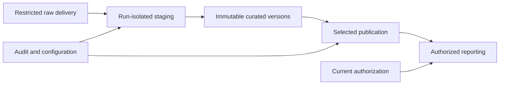

# Proposed physical architecture

PostgreSQL 18 is proposed, not verified against a local installation. No database has been inspected. VS Code edits Markdown/Mermaid and SQL; later authorized Python uses Decimal, a PostgreSQL driver and tests. Faker supplies deterministic synthetic descriptive fields only; Pandas must not coerce money to float. Versions and IANA timezone data are pinned/verified during authorized execution. No external services or live sources are needed; dependencies may need a separately authorized installation.

## Layer and ownership boundaries

| Schema | Proposed contents | Owner role |
| --- | --- | --- |
| raw | Immutable delivered-byte references/lexical input, signed invalid evidence | hcb_raw_owner |
| staging | Run-isolated parsed inputs, validation/disposition scratch | hcb_staging_owner |
| curated | Mapped business entities and selected analytical versions | hcb_curated_owner |
| audit | Manifests, runs, controls, governance, lifecycle and sanitized decisions; migration tracking only in foundation | hcb_audit_owner |
| config | Versioned policy/domain/rule parents | hcb_config_owner |
| security | Entitlements, typed binding helpers and trusted authorization boundary | hcb_security_owner |
| reporting | Authorized masked/aggregate/deidentified interfaces, never raw grants | hcb_reporting_owner |
| extensions | Required extension objects separated from public | hcb_extension_owner |

Schema placement does not itself classify every column. Restricted identity fields and mappings remain protected even within curated/security. No business objects go into public. All owner and application role groups are NOLOGIN, NOSUPERUSER, NOBYPASSRLS, NOINHERIT; no role memberships, credentials or login identities are provisioned. Future bootstrap/migration authority is infrastructure responsibility, not the simulated Administrator. Later controlled grants use actual execution roles explicitly, avoiding permission union.

Propose btree_gist for scalar/range exclusion. Native PostgreSQL numeric/ranges/RLS and Python hashing suffice; pgcrypto/uuid-ossp are not required. Foundation only declares the extension, never installs it in this increment. Execution requires a separately authorized privileged bootstrap session able to create roles, schemas with specified owners and the extension. Fail on preexisting names; do not silently adopt objects. public CREATE is revoked inside the future transaction; this is authorized only for a verified dedicated disposable target.

## Object/dependency order

Foundation schemas/owners/migration ledger -> configuration/provenance parents and stable organization/identity -> business parents and effective histories -> events/snapshots/payment components -> membership/controls -> authorization and reporting interfaces -> lifecycle enforcement and integrated evidence. Audit/config cycles are resolved by creating structures then installing all constraints before loading data. No permanently disabled FK or unsafe bootstrap persona evidence.

One base table per logical entity is the default proposed mapping, not necessarily one final storage object: exact ratios and typed references use justified normalized helpers. Raw/staging layers are operational representations of delivery, not duplicate business authorities. The exhaustive mapping identifies all approved fields; constraints are deferred until future migration authorship and execution.

Deterministic identity uses source-qualified natural identity and a retained mapping registry. Fixture rebuild assigns numeric IDs in canonical order within a fixed edition; replay reuses the registry; new identities append without renumbering. Hash selectors use canonical length-prefixed components and collision checks, never unchecked truncation into bigint. Preserve the approved fixture hash-selection recipe for fixture choices; physical registry encoding is not a change to fixture seed semantics. Run-attempt IDs/time can differ; business payload/manifests must reproduce for identical fixture inputs.

## Static reference notes

Default privileges apply to the creating role; schema-specific revocation cannot subtract a global default. Foundation therefore revokes routine EXECUTE and type USAGE defaults globally for each owner. See [PostgreSQL 18 default privileges](https://www.postgresql.org/docs/18/sql-alterdefaultprivileges.html). The extension is owned by its installing principal, not automatically the extensions-schema owner; trusted-extension members may be bootstrap-owned. A sufficiently privileged authorized bootstrap must perform the explicit existing-function revocation; later exact operator/function grants remain deferred. See [PostgreSQL 18 extension ownership](https://www.postgresql.org/docs/18/sql-createextension.html). No server/extension installation was inspected.
